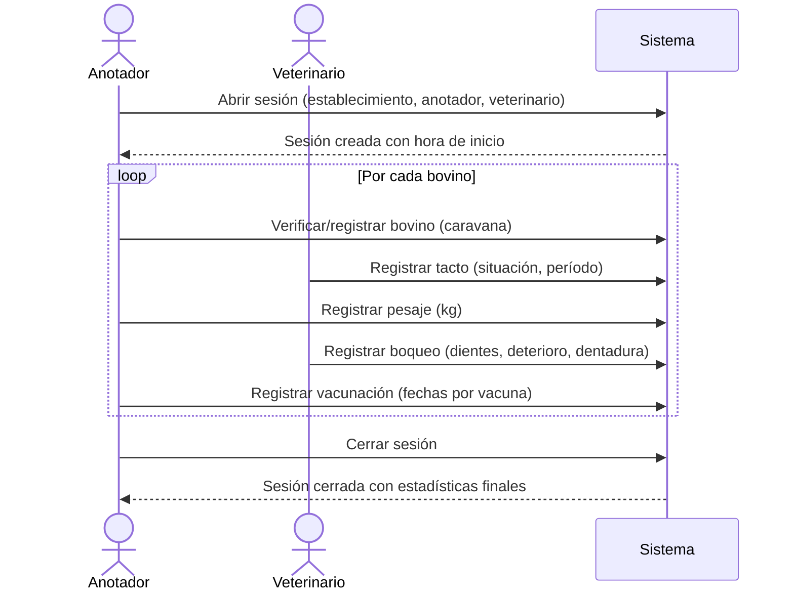
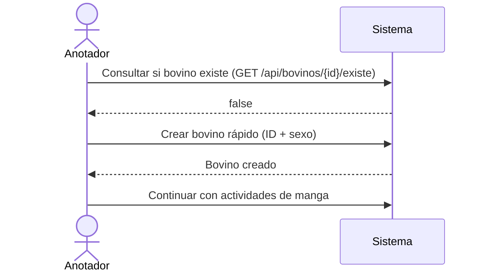

# Spec Funcional — VetRural

> **Audiencia:** PMs, stakeholders, nuevos integrantes del equipo, anyone que necesite entender QUÉ hace este sistema y POR QUÉ.
> **Generada:** 2026-05-11 via reverse-SDD
> **Leyenda:** `[INFERRED]` deducido del código · `[ASSUMPTION]` asunción a validar · `[CONFIRMED]` confirmado por el usuario

---

## 1. Propósito

VetRural es el backend de una aplicación web [CONFIRMED] que permite a veterinarios y productores agropecuarios registrar digitalmente el trabajo de campo durante campañas sanitarias y de revisación de hacienda bovina. Reemplaza el registro en papel que se hace en la manga —el corredor físico por donde pasa el ganado— concentrando en una sola sesión el tacto, el pesaje, el boqueo y la vacunación de cada animal.

## 2. Usuarios y actores

- **Veterinario** — ejecuta las revisaciones clínicas (tacto rectal, boqueo) y supervisa las vacunaciones. Es el actor técnico de la sesión; sólo un usuario de tipo Veterinario puede ser asignado en ese rol.
- **Productor Agropecuario** — dueño o administrador del establecimiento. [INFERRED] consulta el historial de sus animales y los resultados de las sesiones.
- **Anotador** — cualquier usuario que registra los datos mientras el veterinario trabaja en la manga. Puede ser un empleado o el mismo productor.
- **App web (frontend)** [CONFIRMED] — cliente externo que consume la API REST. El sistema no tiene interfaz propia de usuario; toda la interacción ocurre a través de requests HTTP desde la app web.

## 3. Casos de uso principales

### CU-01: Abrir una sesión de trabajo

**Quién:** Anotador o Veterinario
**Qué:** Registrar el inicio de una jornada de revisación en un establecimiento dado.
**Flujo:**
1. El usuario selecciona el establecimiento donde se trabajará.
2. El sistema requiere que se identifiquen tanto un anotador como un veterinario válidos.
3. El sistema crea la sesión con fecha y hora de inicio automáticas.
4. La sesión queda activa y lista para recibir registros de bovinos.

**Reglas asociadas:** RN-01, RN-02.

---

### CU-02: Registrar un bovino nuevo

**Quién:** Anotador
**Qué:** Dar de alta un animal en el sistema antes o durante la sesión.
**Flujo:**
1. El anotador ingresa la caravana electrónica del animal (15 dígitos).
2. Puede registrarlo con datos completos (raza, tipo, nacimiento, sexo, observaciones) o de forma rápida con solo ID y sexo.
3. El sistema guarda el bovino y lo deja disponible para actividades en manga.

**Reglas asociadas:** RN-03, RN-04.

---

### CU-03: Realizar tacto rectal en manga

**Quién:** Veterinario (ejecuta) / Anotador (registra)
**Qué:** Determinar el estado reproductivo de una vaca y registrarlo.
**Flujo:**
1. El bovino ingresa a la manga.
2. El veterinario realiza el tacto y comunica el resultado al anotador.
3. El anotador registra la situación (Preñada / Perdonada / Frigorífico / Apta para servicio) y, si corresponde, el período de gestación.
4. El sistema persiste el registro y devuelve la situación confirmada.

**Reglas asociadas:** RN-05.

---

### CU-04: Registrar pesaje en manga

**Quién:** Anotador
**Qué:** Tomar y guardar el peso del animal mientras está en la manga.
**Flujo:**
1. El bovino es pesado en la balanza incorporada a la manga.
2. El anotador ingresa el peso (en kg).
3. El sistema guarda el pesaje asociado al bovino.

**Reglas asociadas:** RN-05.

---

### CU-05: Realizar boqueo en manga

**Quién:** Veterinario (ejecuta) / Anotador (registra)
**Qué:** Estimar la edad del animal mediante el examen de su dentición.
**Flujo:**
1. El veterinario examina los dientes del animal y determina: cantidad de dientes definitivos (2 / 4 / 6 / 8), tipo de dentadura (de leche / mixta / permanente) y grado de deterioro (nulo / leve / moderado / severo).
2. El anotador registra los tres parámetros.
3. El sistema guarda el boqueo asociado al bovino.

**Reglas asociadas:** RN-05.

---

### CU-06: Registrar vacunación en manga

**Quién:** Anotador
**Qué:** Dejar constancia de las vacunas aplicadas al animal y sus fechas.
**Flujo:**
1. Se aplican las vacunas que correspondan según el plan sanitario.
2. El anotador registra las fechas de aplicación de cada vacuna: Aftosa, Brucelosis, Carbunco, Clostridial, IBR-BVD.
3. El sistema guarda el registro de vacunación del bovino.

**Reglas asociadas:** RN-05.

---

### CU-07: Cerrar sesión de trabajo

**Quién:** Anotador o Veterinario
**Qué:** Finalizar la jornada y registrar la hora de cierre.
**Flujo:**
1. Una vez procesados todos los animales, el usuario cierra la sesión.
2. El sistema registra la fecha y hora de finalización.
3. La sesión queda cerrada con sus estadísticas acumuladas.

**Reglas asociadas:** RN-06.

---

### CU-08: Gestionar lotes

**Quién:** Anotador o Productor
**Qué:** Agrupar bovinos bajo un nombre de lote para facilitar el manejo.
**Flujo:**
1. El usuario crea un lote con un nombre y asigna una lista de bovinos.
2. Puede agregar bovinos individuales a un lote existente.
3. Puede consultar todos los bovinos de un lote.
4. Puede eliminar un lote (los bovinos quedan sin lote, no se eliminan).

---

### CU-09: Consultar historial de bovinos

**Quién:** Veterinario, Productor, Anotador
**Qué:** Ver los datos y registros de un animal específico o de todos los animales.
**Flujo:**
1. El usuario consulta por ID de bovino o lista todos los registrados.
2. El sistema devuelve los datos del animal con sus observaciones.

---

## 4. Reglas de negocio

- **RN-01:** Una sesión solo puede crearse si tanto el anotador como el veterinario existen en el sistema y el veterinario tiene tipo `Veterinario`. [INFERRED]
- **RN-02:** Solo usuarios de tipo `Veterinario` pueden ser asignados al rol de veterinario en una sesión. [INFERRED]
- **RN-03:** Cada bovino se identifica por una caravana electrónica única de hasta 15 caracteres. [INFERRED del constraint en la entidad Animal]
- **RN-04:** [INFERRED] Un bovino puede registrarse con datos mínimos (ID + sexo) para agilizar el ingreso durante la manga; los datos restantes pueden completarse luego.
- **RN-05:** Ninguna actividad en manga (tacto, pesaje, boqueo, vacunación) puede registrarse para un bovino que no esté previamente dado de alta en el sistema. [INFERRED del `validarBovino()` en MangaService]
- **RN-06:** [INFERRED] Una sesión acumula estadísticas (bovinos procesados, peso total, cantidad de preñadas, vacías, edad promedio) que se actualizan durante la jornada.

## 5. Flujos clave

### Flujo: Jornada de manga completa

### Flujo: Registro rápido de bovino nuevo en manga

Si el animal no está en el sistema cuando llega a la manga, el anotador puede darlo de alta rápidamente con solo la caravana y el sexo, sin interrumpir el flujo de trabajo. Los datos restantes (raza, tipo, fecha de nacimiento) se completan después.

## 6. Estados y transiciones

### Entidad: Sesión

| Estado | Descripción | Transiciones permitidas |
|--------|-------------|--------------------------|
| `Activa` | Sesión iniciada, sin hora de fin | → `Cerrada` |
| `Cerrada` | Sesión finalizada con hora de cierre | — (estado final) |

> [INFERRED] No existe un campo de estado explícito; se infiere del campo `fechaHoraFin`: nulo = activa, con valor = cerrada.

### Entidad: Bovino (situación post-tacto)

| Situación | Descripción |
|-----------|-------------|
| `Preñada` | Animal gestante, identificado con período de gestación |
| `Perdonada` | No preñada pero se decide mantener en el rodeo |
| `Frigorífico` | Descartada para faena |
| `Apta_Servicio` | Apta para entrar al servicio (reproducción) |

> Esta situación es resultado del tacto y se registra por evento, no como estado persistente del bovino.

## 7. Out of scope

- No gestiona stock de medicamentos o vacunas (solo registra fechas de aplicación).
- No calcula el plan sanitario ni genera recordatorios de próximas vacunaciones.
- No tiene interfaz de usuario propia — la UI vive en una aplicación web separada. [CONFIRMED]
- No gestiona la comercialización o movimiento de animales entre establecimientos.
- No autentica ni autoriza usuarios en esta versión MVP. [INFERRED]
- No gestiona múltiples especies animales — el modelo está diseñado exclusivamente para bovinos.

## 8. Glosario de dominio

- **Manga:** corredor físico de madera o metal por donde pasan los bovinos de a uno para ser revisados y tratados. Es el escenario físico del trabajo veterinario.
- **Caravana electrónica:** identificador único del animal, típicamente un chip o tag en la oreja con hasta 15 dígitos.
- **Tacto rectal:** procedimiento veterinario para determinar el estado reproductivo de la vaca (preñez y período de gestación).
- **Boqueo:** examen de la dentición del animal para estimar su edad. Se evalúan cantidad de dientes definitivos, tipo de dentadura y grado de deterioro.
- **Pesaje:** toma del peso del animal en kilogramos.
- **Vacunación:** aplicación de vacunas del plan sanitario obligatorio o preventivo (Aftosa, Brucelosis, Carbunco, Clostridial, IBR-BVD).
- **Sesión:** unidad de trabajo que agrupa todas las actividades realizadas en un establecimiento en una jornada. Tiene hora de inicio, hora de fin, anotador y veterinario asignados.
- **Establecimiento:** campo, estancia o explotación agropecuaria donde se realiza el trabajo. Se identifica por nombre.
- **Lote:** agrupación lógica de bovinos bajo un nombre común, usada para organizar el manejo del rodeo.
- **Anotador:** persona que opera el sistema durante la manga, registrando los datos que el veterinario comunica.
- **Preñada / Perdonada / Frigorífico / Apta para servicio:** categorías de resultado del tacto que definen el destino productivo del animal.

## 9. Asunciones a validar

- [x] El proyecto es un MVP/prototipo [CONFIRMED]
- [x] La app web existe en un repo separado [CONFIRMED]
- [ ] ASSUMPTION: La sesión puede tener múltiples instancias por día en el mismo establecimiento — no hay restricción que lo impida en el código, pero no está explicitado como requisito.
- [ ] ASSUMPTION: Los campos de estadísticas de la sesión (contBovinos, acumPeso, contPrenadas, contVacias, edadPromedio) son actualizados manualmente por el cliente web, no calculados automáticamente por el backend.
- [ ] ASSUMPTION: La entidad `Animal` existe como base para futura extensión a otras especies (equinos, ovinos, etc.), aunque por ahora solo se usa `Bovino`.
