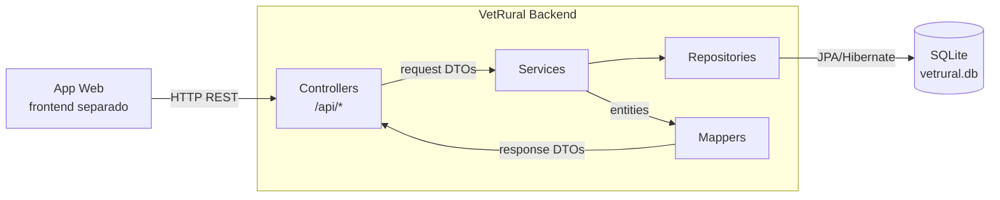
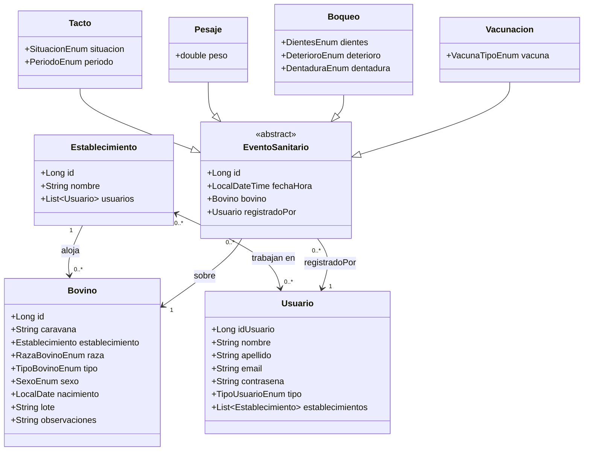

# Spec Técnica — VetRural

> **Audiencia:** Desarrolladores que tienen que tocar este código.
> **Actualizada:** 2026-05-13 — refactor de modelo de dominio + review por Opus 4.7
> **Leyenda:** `[ACTUAL]` estado actual del código · `[OBJETIVO]` estado a implementar · `[CONFIRMED]` confirmado por el usuario · `[ASSUMPTION]` asunción a validar

---

## 1. Resumen técnico

VetRural es un monolito Spring Boot que expone una API REST. Corre en JVM (Java 17), persiste en SQLite mediante Hibernate/JPA, y está pensado para correr como proceso único en un servidor local o en la nube. [CONFIRMED] Una app web separada consume la API como único cliente.

## 2. Stack y versiones

| Componente | Tecnología | Versión | Notas |
|------------|------------|---------|-------|
| Lenguaje | Java | 17 | |
| Framework principal | Spring Boot | 4.0.6 | Incluye Spring MVC |
| Persistencia | Spring Data JPA + Hibernate | (gestionada por Boot) | Dialect: SQLiteDialect (hibernate-community-dialects) |
| Base de datos | SQLite | (runtime) | Archivo local `vetrural.db` |
| Build | Maven | (wrapper incluido) | mvnw / mvnw.cmd |
| Boilerplate | Lombok | (gestionada por Boot) | `@Getter`, `@Setter`, `@NoArgsConstructor`, `@AllArgsConstructor` |
| Testing | Spring Boot Test (jdbc, thymeleaf, webmvc) | (gestionada por Boot) | Sin tests implementados |

> Thymeleaf sigue en deps pero sin uso. Candidato a eliminar.

## 3. Arquitectura

### 3.1 Estilo arquitectónico

Monolito en capas clásico (Spring MVC): Controller → Service → Repository → Entity. No hay DDD, hexagonal ni event-driven. La lógica de negocio vive en los Services; los Controllers son delgados y solo traducen HTTP ↔ llamadas de servicio. Los Controllers nunca devuelven entidades directamente — usan DTOs de respuesta mapeados por la capa `mapper/`.

**Patrón interface + Impl en services:** cada service se separa en una interface (contrato público) y una clase `Impl` (implementación, anotada con `@Service`). Los Controllers inyectan la interface; Spring resuelve la `Impl` por tipo. Esto habilita test doubles directos, cumple el principio de inversión de dependencias y desacopla a los consumidores del detalle de implementación. Aplica a **todos** los services sin excepción — la consistencia vale más que ahorrar archivos en los CRUD simples.

### 3.2 Estructura de carpetas objetivo

```
src/main/java/vetrural/mvc/
├── MvcApplication.java
├── controller/
│   ├── BovinoController.java
│   ├── EstablecimientoController.java
│   ├── MangaController.java
│   └── UsuarioController.java
├── service/
│   ├── BovinoService.java              # interface
│   ├── BovinoServiceImpl.java          # @Service
│   ├── EstablecimientoService.java
│   ├── EstablecimientoServiceImpl.java
│   ├── MangaService.java
│   ├── MangaServiceImpl.java
│   ├── TactoService.java
│   ├── TactoServiceImpl.java
│   ├── PesajeService.java
│   ├── PesajeServiceImpl.java
│   ├── BoqueoService.java
│   ├── BoqueoServiceImpl.java
│   ├── VacunacionService.java
│   ├── VacunacionServiceImpl.java
│   ├── UsuarioService.java
│   └── UsuarioServiceImpl.java
├── repository/
│   ├── BovinoRepository.java
│   ├── EstablecimientoRepository.java
│   ├── EventoSanitarioRepository.java  # Queries polimórficas sobre la base
│   ├── UsuarioRepository.java
│   ├── TactoRepository.java
│   ├── PesajeRepository.java
│   ├── BoqueoRepository.java
│   └── VacunacionRepository.java
├── entity/
│   ├── Bovino.java
│   ├── Establecimiento.java
│   ├── Usuario.java
│   ├── EventoSanitario.java       # Abstracta, herencia JOINED
│   ├── Tacto.java
│   ├── Pesaje.java
│   ├── Boqueo.java
│   └── Vacunacion.java
├── dto/
│   ├── request/
│   │   ├── CrearBovinoRequest.java
│   │   ├── CrearBovinoRapidoRequest.java
│   │   ├── CrearEstablecimientoRequest.java
│   │   ├── CrearUsuarioRequest.java
│   │   ├── RegistrarTactoRequest.java
│   │   ├── RegistrarPesajeRequest.java
│   │   ├── RegistrarBoqueoRequest.java
│   │   └── RegistrarVacunacionRequest.java
│   └── response/
│       ├── BovinoResponse.java
│       ├── EstablecimientoResponse.java
│       ├── TactoResponse.java
│       ├── PesajeResponse.java
│       ├── BoqueoResponse.java
│       └── VacunacionResponse.java
├── mapper/
│   ├── BovinoMapper.java
│   ├── EstablecimientoMapper.java
│   ├── TactoMapper.java
│   ├── PesajeMapper.java
│   ├── BoqueoMapper.java
│   └── VacunacionMapper.java
└── enumerations/
    ├── TipoBovinoEnum.java
    ├── RazaBovinoEnum.java
    ├── SexoEnum.java
    ├── SituacionEnum.java
    ├── PeriodoEnum.java
    ├── DientesEnum.java
    ├── DeterioroEnum.java
    ├── DentaduraEnum.java
    ├── TipoUsuarioEnum.java
    └── VacunaTipoEnum.java
```

### 3.3 Diagrama de componentes



## 4. Modelo de datos

### 4.1 Diagrama de entidades [OBJETIVO]



### 4.2 Entidades [OBJETIVO]

#### `Establecimiento`

- **Propósito:** lugar físico donde viven los animales y donde se realizan las jornadas de trabajo.
- **Atributos:** `id` (Long, PK, autogenerado) · `nombre` (String)
- **Relaciones:** `usuarios` (@ManyToMany con Usuario, dueño de la relación — tiene la tabla de join `establecimiento_usuarios`)
- **Nota:** los bovinos del establecimiento se consultan vía `BovinoRepository.findByEstablecimiento()`, no con una colección en la entidad. Evita carga lazy accidental de miles de bovinos al serializar un establecimiento.

#### `Bovino`

- **Propósito:** animal bovino identificado por caravana electrónica.
- **Atributos:** `id` (Long, PK, autogenerado) · `caravana` (String, max 15 chars, `unique = true`, `nullable = false` — caravana electrónica, identificador de negocio) · `raza` (RazaBovinoEnum, nullable) · `tipo` (TipoBovinoEnum, nullable) · `sexo` (SexoEnum) · `nacimiento` (LocalDate, nullable) · `lote` (String, nullable) · `observaciones` (String, nullable)
- **Relaciones:** `establecimiento` (@ManyToOne, `nullable = false`)
- **Nota:** `raza`, `tipo` y `nacimiento` son nullable para soportar el registro rápido en manga. `establecimiento` nunca es nulo — todo bovino pertenece a un establecimiento desde el momento de su creación.
- **PK sintética + caravana única:** ver TD-09. La PK es Long autogenerada; `caravana` es la identidad de negocio con constraint de unicidad. Las FKs en `EventoSanitario` apuntan a la PK Long.

#### `Usuario`

- **Propósito:** persona que opera el sistema.
- **Atributos:** `idUsuario` (Long, PK, autogenerado) · `nombre` · `apellido` · `email` (`unique = true`) · `contrasena` (hash BCrypt — nunca texto plano) · `tipo` (TipoUsuarioEnum)
- **Relaciones:** `establecimientos` (@ManyToMany con Establecimiento, lado inverso — `mappedBy = "usuarios"`)
- **Restricción de negocio:** [OBJETIVO] solo usuarios de tipo `Veterinario` o `Anotador` pueden registrar `EventoSanitario`. Validado en `MangaService`.
- **Hashing:** [OBJETIVO] `UsuarioServiceImpl` aplica `BCryptPasswordEncoder.encode(contrasena)` antes de persistir. El campo persistido nunca es la contraseña original. Ver TD-10.

#### `EventoSanitario` (abstracta)

- **Propósito:** clase base para todos los procedimientos sanitarios registrados sobre un bovino.
- **Atributos:** `id` (Long, PK, autogenerado) · `fechaHora` (LocalDateTime)
- **Relaciones:** `bovino` (@ManyToOne Bovino, `nullable = false`) · `registradoPor` (@ManyToOne Usuario, `nullable = false`)
- **Herencia:** `InheritanceType.JOINED` — tabla `EventoSanitario` con los campos base + tabla hija por subtipo con sus campos propios.
- **IDs de subtipos:** las entidades hijas (`Tacto`, `Pesaje`, `Boqueo`, `Vacunacion`) **no declaran su propio `@Id`** — heredan el `id` de `EventoSanitario`. Los campos `idTacto`, `idPesaje`, `idBoqueo`, `idVacunacion` del código actual deben eliminarse.
- **Query patrón por tipo:** `findTopByBovinoOrderByFechaHoraDesc(Bovino bovino)` en el repository del subtipo.
- **Query polimórfica:** `EventoSanitarioRepository.findByBovinoOrderByFechaHoraDesc(Bovino bovino)` devuelve todos los eventos del bovino sin importar el tipo.

#### `Tacto`

- **Propósito:** resultado de un tacto rectal — determina el estado reproductivo de la vaca.
- **Atributos propios:** `situacion` (SituacionEnum) · `periodo` (PeriodoEnum, nullable — solo aplica si `situacion = Preñada`)

#### `Pesaje`

- **Propósito:** registro del peso del animal en kg.
- **Atributos propios:** `peso` (double) — se usa `double` y no `float` para evitar pérdida de precisión en datos biológicos.

#### `Boqueo`

- **Propósito:** examen de dentición para estimar la edad del animal.
- **Atributos propios:** `dientes` (DientesEnum) · `deterioro` (DeterioroEnum) · `dentadura` (DentaduraEnum)

#### `Vacunacion`

- **Propósito:** registro de una vacuna aplicada al animal.
- **Atributos propios:** `vacuna` (VacunaTipoEnum)
- **Nota:** una fila por vacuna aplicada. La fecha de aplicación es `EventoSanitario.fechaHora`. Si se aplican varias vacunas en la misma visita, se crean múltiples registros — uno por vacuna.

### 4.3 Enumeraciones

| Enum | Valores |
|------|---------|
| `TipoBovinoEnum` | Ternero · Novillito · Novillo · Vaquillona · Vaca · Torito · Toro |
| `RazaBovinoEnum` | Angus · Hereford · Brangus · Braford · Holstein · Jersey · Charolais · Limousin · Simmental · Brahman · Nelore · Gyr |
| `SexoEnum` | Macho · Hembra |
| `SituacionEnum` | Preñada · Perdonada · Frigorifico · Apta_Servicio |
| `PeriodoEnum` | Menos_3_Meses · Entre_3_y_6_Meses · Mas_6_Meses |
| `DientesEnum` | Dos · Cuatro · Seis · Ocho |
| `DeterioroEnum` | Nulo · Leve · Moderado · Severo |
| `DentaduraEnum` | De_Leche · Mixta · Permanente |
| `TipoUsuarioEnum` [OBJETIVO] | Veterinario · **Anotador** · Productor_Agropecuario |
| `VacunaTipoEnum` [OBJETIVO] | Aftosa · Brucelosis · Carbunco · Clostridial · IBR_BVD |

### 4.4 Migración de datos

Este refactor cambia el schema drásticamente: elimina tablas (`Animal`, `Sesion`), agrega tablas (`Establecimiento`, `EventoSanitario`), cambia FKs (de `String idBovino` a `bovino_id` FK real) y cambia columnas (`Vacunacion` de 5 fechas a 1 enum). **`ddl-auto=update` no maneja renames ni transformaciones de datos.**

**Decisión para MVP:** se asume base de datos en blanco. Borrar `vetrural.db` antes de levantar el backend con el nuevo código. No hay datos de producción que preservar en esta etapa.

## 5. Superficie de API

### 5.1 Endpoints HTTP [OBJETIVO]

**Establecimientos** (`/api/establecimientos`)

| Método | Ruta | Propósito | Status éxito |
|--------|------|-----------|--------------|
| `GET` | `/api/establecimientos` | Listar establecimientos | 200 |
| `GET` | `/api/establecimientos/{id}` | Obtener establecimiento por ID | 200 / 404 |
| `POST` | `/api/establecimientos` | Crear establecimiento | 201 + `Location` |
| `GET` | `/api/establecimientos/{id}/bovinos` | Listar bovinos del establecimiento | 200 |
| `POST` | `/api/establecimientos/{id}/usuarios/{usuarioId}` | Asociar usuario a establecimiento | 204 |
| `DELETE` | `/api/establecimientos/{id}/usuarios/{usuarioId}` | Desasociar usuario de establecimiento | 204 |

**Bovinos** (`/api/bovinos`) — `{id}` es la PK Long; las búsquedas por caravana usan `caravana` como query param.

| Método | Ruta | Propósito | Status éxito |
|--------|------|-----------|--------------|
| `GET` | `/api/bovinos` | Listar todos los bovinos | 200 |
| `GET` | `/api/bovinos/{id}` | Obtener bovino por PK Long | 200 / 404 |
| `GET` | `/api/bovinos/buscar?caravana={caravana}` | Buscar bovino por caravana | 200 / 404 |
| `GET` | `/api/bovinos/existe?caravana={caravana}` | Verificar existencia por caravana (útil en manga) | 200 (boolean) |
| `POST` | `/api/bovinos` | Crear bovino con datos completos | 201 + `Location` |
| `POST` | `/api/bovinos/rapido` | Crear bovino rápido (caravana + sexo + establecimiento) | 201 + `Location` |
| `PUT` | `/api/bovinos/{id}/observaciones` | Actualizar observaciones | 200 |
| `PUT` | `/api/bovinos/{id}/lote` | Asignar bovino a lote | 204 |
| `GET` | `/api/bovinos/lotes` | Listar todos los lotes (query distinct) | 200 |
| `GET` | `/api/bovinos/lotes/{lote}` | Listar bovinos de un lote | 200 |
| `POST` | `/api/bovinos/lotes` | Crear lote con lista de bovinos (valida que todos existan) | 201 |
| `DELETE` | `/api/bovinos/lotes?nombre={lote}` | Eliminar lote | 204 |

**Manga** (`/api/manga`)

| Método | Ruta | Propósito |
|--------|------|-----------|
| `POST` | `/api/manga/tacto` | Registrar tacto rectal |
| `POST` | `/api/manga/pesaje` | Registrar pesaje |
| `POST` | `/api/manga/boqueo` | Registrar boqueo |
| `POST` | `/api/manga/vacunacion` | Registrar vacunación (una vacuna por request) |
| `GET` | `/api/manga/{bovinoId}/eventos` | Cronología completa de eventos del bovino |
| `GET` | `/api/manga/{bovinoId}/ultimo-tacto` | Último tacto del bovino |
| `GET` | `/api/manga/{bovinoId}/ultimo-pesaje` | Último pesaje del bovino |
| `GET` | `/api/manga/{bovinoId}/ultimo-boqueo` | Último boqueo del bovino |
| `GET` | `/api/manga/{bovinoId}/vacunaciones` | Historial de vacunaciones del bovino |

**Usuarios** (`/api/usuarios`)

| Método | Ruta | Propósito | Status éxito |
|--------|------|-----------|--------------|
| `GET` | `/api/usuarios` | Listar usuarios | 200 |
| `GET` | `/api/usuarios/{id}` | Obtener usuario por ID | 200 / 404 |
| `POST` | `/api/usuarios` | Crear usuario (hashea contraseña) | 201 + `Location` |
| `DELETE` | `/api/usuarios/{id}` | Eliminar usuario | 204 |
| `GET` | `/api/usuarios/veterinarios` | Listar veterinarios | 200 |
| `GET` | `/api/usuarios/{id}/establecimientos` | Listar establecimientos del usuario | 200 |

### 5.2 Autenticación / Autorización

[ACTUAL] No existe. No hay Spring Security configurado. Todos los endpoints son públicos.

[OBJETIVO] `MangaService` validará que el `registradoPorId` corresponde a un usuario de tipo `Veterinario` o `Anotador` antes de persistir cualquier `EventoSanitario`. Esta validación **no existe aún en el código** — está pendiente de implementar.

### 5.3 DTOs

#### Request DTOs

Todos los request DTOs deben anotarse con `@Valid` en el controller; los campos obligatorios con `@NotNull` / `@NotBlank`.

| DTO | Campos |
|-----|--------|
| `CrearEstablecimientoRequest` | `nombre` (NotBlank) |
| `CrearBovinoRequest` | `caravana` (NotBlank) · `establecimientoId` (Long, NotNull) · `raza` · `tipo` · `sexo` (NotNull) · `nacimiento` · `observaciones` |
| `CrearBovinoRapidoRequest` | `caravana` (NotBlank) · `establecimientoId` (Long, NotNull) · `sexo` (NotNull) |
| `CrearUsuarioRequest` | `nombre` · `apellido` · `email` (NotBlank, Email) · `contrasena` (NotBlank, se hashea en el service) · `tipo` (NotNull) |
| `RegistrarTactoRequest` | `bovinoId` (Long, NotNull) · `registradoPorId` (Long, NotNull) · `situacion` (NotNull) · `periodo` (nullable) |
| `RegistrarPesajeRequest` | `bovinoId` (Long) · `registradoPorId` (Long) · `peso` (Positive) |
| `RegistrarBoqueoRequest` | `bovinoId` (Long) · `registradoPorId` (Long) · `dientes` · `deterioro` · `dentadura` |
| `RegistrarVacunacionRequest` | `bovinoId` (Long) · `registradoPorId` (Long) · `vacuna` (VacunaTipoEnum, NotNull) |

#### Response DTOs

Los controllers nunca serializan entidades directamente — evita ciclos de serialización y exposición de datos sensibles (ej: `contrasena`).

| DTO | Campos |
|-----|--------|
| `EstablecimientoResponse` | `id` (Long) · `nombre` |
| `BovinoResponse` | `id` (Long, PK) · `caravana` (String) · `establecimientoId` · `raza` · `tipo` · `sexo` · `nacimiento` · `lote` · `observaciones` |
| `TactoResponse` | `id` · `fechaHora` · `bovinoId` (Long) · `registradoPorId` (Long) · `situacion` · `periodo` |
| `PesajeResponse` | `id` · `fechaHora` · `bovinoId` (Long) · `registradoPorId` (Long) · `peso` |
| `BoqueoResponse` | `id` · `fechaHora` · `bovinoId` (Long) · `registradoPorId` (Long) · `dientes` · `deterioro` · `dentadura` |
| `VacunacionResponse` | `id` · `fechaHora` · `bovinoId` (Long) · `registradoPorId` (Long) · `vacuna` |
| `UsuarioResponse` | `idUsuario` · `nombre` · `apellido` · `email` · `tipo` — **nunca** expone `contrasena` |

### 5.4 Mappers

Clases estáticas manuales (sin MapStruct ni librerías extra). Un mapper por entidad — evita una clase monolítica con responsabilidades mezcladas. Cada mapper expone `toResponse(Entity e)`.

| Mapper | Responsabilidad |
|--------|----------------|
| `BovinoMapper` | `Bovino → BovinoResponse` |
| `EstablecimientoMapper` | `Establecimiento → EstablecimientoResponse` |
| `TactoMapper` | `Tacto → TactoResponse` |
| `PesajeMapper` | `Pesaje → PesajeResponse` |
| `BoqueoMapper` | `Boqueo → BoqueoResponse` |
| `VacunacionMapper` | `Vacunacion → VacunacionResponse` |
| `UsuarioMapper` | `Usuario → UsuarioResponse` (omite contraseña) |
| `EventoSanitarioMapper` | `EventoSanitario → EventoSanitarioResponse` (cronología polimórfica) |

**Detección de subtipo en `EventoSanitarioMapper`:** para evitar nombres de clase proxy de Hibernate (`Tacto$HibernateProxy$xyz`), usar `org.hibernate.Hibernate.getClass(entidad).getSimpleName()` en vez de `entidad.getClass().getSimpleName()`. Alternativa: cadena de `instanceof` explícita. Esto fixea BUG-07.

### 5.5 Manejo global de errores

`GlobalExceptionHandler` (`@ControllerAdvice`) mapea excepciones a status HTTP de forma consistente. Los services lanzan la excepción semánticamente correcta; el handler la convierte a respuesta HTTP.

| Excepción | Status | Cuándo |
|-----------|--------|--------|
| `MethodArgumentNotValidException` | 400 | `@Valid` falla — body con detalle de campos inválidos |
| `HttpMessageNotReadableException` | 400 | JSON malformado — body con mensaje genérico, **nunca** `ex.getMessage()` |
| `IllegalArgumentException` | 400 | Reglas de negocio violadas (ej: `caravana` ya existe, situación/periodo incompatibles) |
| `EntityNotFoundException` | 404 | Recurso no encontrado (lookup por id de cualquier entidad) |
| `Exception` (catch-all) | 500 | Error inesperado — body genérico, log completo |

**Regla clave:** las búsquedas que no encuentran resultados lanzan `EntityNotFoundException`, **no** `IllegalArgumentException`. Esto fixea la inconsistencia en la que `GET /api/bovinos/{id}` devolvía 404 pero `PUT /api/bovinos/{id}/observaciones` devolvía 400 para el mismo escenario (bovino no encontrado).

**Cuerpo de error estándar:** `{ "error": "mensaje accionable para el cliente" }`. Nunca incluir stack traces ni `ex.getMessage()` para excepciones de infraestructura/JVM.

### 5.6 Convenciones HTTP

| Operación | Status éxito | Headers |
|-----------|--------------|---------|
| `POST` que crea recurso | **201 Created** | `Location: /api/<recurso>/{id}` |
| `POST` para acción sin recurso nuevo (ej: asociar usuario) | 204 No Content | — |
| `PUT` con body de respuesta | 200 OK | — |
| `PUT` sin body de respuesta | 204 No Content | — |
| `DELETE` | 204 No Content | — |
| `GET` exitoso | 200 OK | — |

Los controllers nunca retornan `ResponseEntity.ok().build()` para operaciones sin cuerpo — usan `ResponseEntity.noContent().build()`. Fixea BUG-05 y BUG-06.

### 5.7 Invariantes de servicio (validaciones obligatorias)

Estas validaciones son parte del contrato del service y previenen los bugs lógicos detectados:

**`BovinoServiceImpl.crearBovino` / `crearBovinoRapido`** (fixea BUG-01)
- Antes de persistir: `if (bovinoRepository.existsByCaravana(caravana)) throw new IllegalArgumentException("Ya existe un bovino con caravana: " + caravana);`
- Como la PK ahora es Long autogenerada, Spring Data correctamente llama `persist()` (no `merge()`). La validación de unicidad sobre `caravana` se hace explícita porque el `@Column(unique=true)` lanza la violación en `flush()` (timing impredecible) y con mensaje poco accionable.

**`BovinoServiceImpl.crearLote`** (fixea BUG-03)
- Validar que todos los `bovinoId` existen antes de iterar. Si alguno falta, lanzar `EntityNotFoundException` con la lista de IDs faltantes. El `@Transactional` garantiza rollback.

**`BovinoServiceImpl.anadirBovinoALote`** (fixea BUG-02)
- Usar `obtenerOFallar(idBovino)` (que lanza `EntityNotFoundException` si no existe). No usar `findById(...).ifPresent(...)` que silencia el error.

**`BovinoServiceImpl.getLotes`** (fixea BUG-04)
- Implementar como `bovinoRepository.findDistinctLotes()` con query `@Query("SELECT DISTINCT b.lote FROM Bovino b WHERE b.lote IS NOT NULL")`. No cargar `findAll()` en memoria.

**`BovinoServiceImpl.obtenerOFallar`**
- Lanzar `EntityNotFoundException`, no `IllegalArgumentException`. Idem para todos los `obtenerOFallar(...)` de los demás services.

**`UsuarioServiceImpl.crearUsuario`** (fixea BUG-08)
- Hashear `contrasena` con `BCryptPasswordEncoder.encode(...)` antes de persistir. Validar email único.

## 6. Dependencias externas

### 6.1 Servicios externos

Ninguno. El sistema es completamente autónomo.

### 6.2 Librerías críticas

- **Spring Boot 4.0.6** — framework principal: IoC, MVC, Data JPA.
- **SQLite JDBC (org.xerial)** — driver JDBC para SQLite.
- **hibernate-community-dialects** — dialecto de Hibernate para SQLite.
- **Lombok** — generación de boilerplate en tiempo de compilación.
- **spring-security-crypto** — `BCryptPasswordEncoder` para hashing de contraseñas. Dependencia mínima, no requiere configurar Spring Security completo.
- **spring-boot-starter-validation** — Jakarta Bean Validation (`@Valid`, `@NotBlank`, `@NotNull`, `@Email`, etc.) en request DTOs.

## 7. Configuración

Archivo: `src/main/resources/application.properties`

```properties
spring.application.name=mvc
spring.datasource.url=jdbc:sqlite:vetrural.db
spring.datasource.driver-class-name=org.sqlite.JDBC
spring.jpa.database-platform=org.hibernate.community.dialect.SQLiteDialect
spring.jpa.hibernate.ddl-auto=update
spring.jpa.show-sql=true
```

## 8. Decisiones técnicas y trade-offs

### TD-01: SQLite como base de datos

- **Decisión:** SQLite — base de datos embebida en un archivo local (`vetrural.db`).
- **Trade-off:** cero infraestructura, portabilidad total. Contra: sin concurrencia real, sin replicación, sin acceso remoto simultáneo desde múltiples dispositivos.

### TD-02: Registro rápido de bovino

- **Decisión:** endpoint `POST /api/bovinos/rapido` que crea un bovino con solo ID + sexo + establecimiento, dejando raza/tipo/nacimiento nulos.
- **Trade-off:** fluidez en manga vs. datos incompletos. El frontend debe permitir completar los datos después.

### TD-03: `EventoSanitario` con herencia JOINED

- **Decisión:** clase abstracta `EventoSanitario` como base de `Tacto`, `Pesaje`, `Boqueo` y `Vacunacion`, con `InheritanceType.JOINED`.
- **Trade-off:** elimina duplicación de `bovino`/`fechaHora`/`registradoPor` en las cuatro entidades, habilita `EventoSanitarioRepository` para queries polimórficas (cronología completa del animal). Contra: un JOIN extra por cada consulta de subtipo. Aceptable dado el volumen esperado.
- **Alternativa descartada:** `SINGLE_TABLE` generaría demasiadas columnas nullable dado que los subtipos tienen campos muy distintos.

### TD-04: `MangaService` como orquestador

- **Decisión:** `MangaService` valida que el bovino existe y que el usuario tiene permisos (`Veterinario` o `Anotador`), luego delega a los services específicos.
- **Trade-off:** centraliza las dos validaciones transversales de manga en un único lugar. La indirección es justificada mientras esas validaciones existan.

### TD-05: Lotes como campo String en Bovino

- **Decisión:** el lote se guarda como `String` en `Bovino`, no como entidad con FK.
- **Trade-off:** simplicidad de implementación. Contra: sin integridad referencial; inconsistencias posibles por diferencias en capitalización o espacios.

### TD-06: Una fila por vacuna en `Vacunacion`

- **Decisión:** cada aplicación de vacuna es un `EventoSanitario` separado con un campo `VacunaTipoEnum`.
- **Trade-off:** modelo normalizado, queries limpias ("último aftosa del animal X"), fácil de extender con nuevas vacunas (agregar valor al enum). Contra: si se aplican 5 vacunas juntas, el frontend envía 5 requests. Si eso resulta problemático en campo (conectividad rural), se puede agregar un endpoint `POST /api/manga/vacunaciones` que acepte una lista — pendiente de necesidad real.
- **Alternativa no tomada:** enum + campo `observacion: String` para vacunas fuera del catálogo. Descartada por complejidad innecesaria en MVP.

### TD-07: Sin entidad `Sesion`

- **Decisión:** se eliminó `Sesion` como entidad de backend. Cada `EventoSanitario` tiene su propio `fechaHora` y `registradoPor`.
- **Trade-off:** modelo más simple y centrado en el dominio. Contra: (1) no hay agrupación explícita de eventos por jornada — si se necesita "todos los eventos del día X en el establecimiento Y", se consulta por rango de fechas y bovinos del establecimiento; (2) se pierde la funcionalidad de estadísticas agregadas que tenía `SesionService.actualizarEstadisticas()` (`contBovinos`, `acumPeso`, `contPrenadas`, `contVacias`, `edadPromedio`). Esos KPIs pasan a ser responsabilidad del frontend, que puede calcularlos a partir de los eventos individuales que ya retorna el backend.

### TD-08: `Establecimiento` sin `@OneToMany List<Bovino>`

- **Decisión:** `Establecimiento` no tiene una colección `bovinos` en la entidad. Los bovinos de un establecimiento se obtienen vía `BovinoRepository.findByEstablecimiento(establecimiento)`.
- **Trade-off:** evita carga lazy accidental de miles de bovinos al serializar un `Establecimiento` (riesgo real si un controller serializa entidades directamente o si un dev agrega `@JsonManagedReference` sin pensar). El endpoint `GET /api/establecimientos/{id}/bovinos` existe y hace la query explícita.

### TD-09: `Bovino` con PK Long sintética + `caravana` como business key

- **Decisión:** `Bovino` usa una PK `Long id` autogenerada (consistente con `Establecimiento` y `Usuario`). La caravana electrónica se persiste como `caravana` (`String unique=true nullable=false`) — sigue siendo la identidad de negocio.
- **Trade-off positivo:** (1) consistencia de PKs en toda la app; (2) **fixea BUG-01 incidentalmente** — con `id=null` en entidades nuevas, Spring Data invoca `persist()` (no `merge()`), eliminando el riesgo de sobreescritura silenciosa por defecto; (3) FKs más eficientes (Long vs String); (4) permite renombrar/corregir una caravana sin propagar cambios a todas las FKs.
- **Trade-off negativo:** el frontend necesita resolver caravana → `id` antes de operar (un `GET /api/bovinos/buscar?caravana=X` extra). En manga este lookup ocurre una sola vez por animal y se cachea para los eventos de esa pasada.
- **Validación de unicidad de caravana:** se hace explícita en `BovinoServiceImpl.crearBovino` (chequeo previo con `existsByCaravana`) en lugar de depender del constraint de DB, para devolver 400 con un mensaje accionable en vez de 500 por `DataIntegrityViolationException` en `flush()`.

### TD-10: Hashing de contraseñas con BCrypt

- **Decisión:** `UsuarioServiceImpl.crearUsuario` invoca `BCryptPasswordEncoder.encode(contrasena)` antes de persistir. Se incorpora la dep `spring-security-crypto` sin habilitar el resto de Spring Security.
- **Trade-off:** mínima superficie de cambio (un encoder + una llamada), pero permite borrar el riesgo de exponer contraseñas en claro al volcar la DB. BCrypt es el estándar para passwords (algoritmo lento, salt automático). Contra: agrega ~20ms de CPU por creación de usuario — aceptable.
- **Nota:** sin Spring Security completo, no hay autenticación basada en hash todavía (la verificación se hará cuando se implemente login). El hashing al guardar es independiente y se aplica desde ya para no tener que migrar datos después.

## 9. Deployment y runtime

- **Cómo se buildea:** `./mvnw clean package` → JAR ejecutable en `target/`.
- **Cómo corre:** `java -jar target/mvc-0.0.1-SNAPSHOT.jar` (Spring Boot embedded Tomcat).
- **Dónde corre:** [ASSUMPTION] local o servidor simple. Sin Dockerfile ni CI/CD.

## 10. Observabilidad

- **Logging:** Logback estándar de Spring Boot. `show-sql=true` imprime queries en consola.
- **Métricas / Tracing / Health:** no configurado.

## 11. Testing

- **Frameworks disponibles:** Spring Boot Test (jdbc-test, thymeleaf-test, webmvc-test).
- **Estado actual:** solo existe `MvcApplicationTests.java` con el test vacío del Initializr.
- **Cómo correr:** `./mvnw test`

## 12. Gaps técnicos

Los items marcados [OBJETIVO] se resuelven en este refactor (ver Sección 14). Los marcados [POST-MVP] quedan abiertos.

- [OBJETIVO] **Validaciones de entrada:** todos los request DTOs llevan anotaciones Jakarta Validation y los controllers anotan los parámetros con `@Valid`. Ver Sección 5.3 y 5.5.
- [OBJETIVO] **Manejo global de errores:** `GlobalExceptionHandler` mapea `IllegalArgumentException` → 400, `EntityNotFoundException` → 404, `MethodArgumentNotValidException` → 400, `HttpMessageNotReadableException` → 400 con mensaje genérico (no expone internos). Ver Sección 5.5.
- [OBJETIVO] **Status codes correctos:** POSTs de creación retornan 201 con `Location`; operaciones sin cuerpo retornan 204. Ver Sección 5.6.
- [OBJETIVO] **Contraseña hasheada:** `UsuarioServiceImpl` aplica BCrypt antes de persistir. Ver TD-10.
- [OBJETIVO] **Validaciones de invariantes en services:** unicidad de caravana al crear bovino, existencia de bovinos al armar lotes, fallo explícito en lookups. Ver Sección 5.7.
- [OBJETIVO] **`EventoSanitarioMapper` con detección de subtipo robusta:** usa `Hibernate.getClass()` para no exponer nombres de proxy. Ver Sección 5.4.
- **Sin autenticación/autorización end-to-end:** no hay login ni filtros de Spring Security. La validación de tipo de usuario (`Veterinario`/`Anotador`) en `MangaService` sí se implementa, pero los endpoints siguen siendo públicos. Gap parcialmente cubierto.
- [POST-MVP] **Sin edición ni eliminación de eventos sanitarios:** no hay endpoints `PUT`/`DELETE` sobre `Tacto`, `Pesaje`, `Boqueo` ni `Vacunacion`. Un error de tipeo en un peso no se puede corregir.
- [POST-MVP] **Sin idempotencia en registro de eventos:** un retry del frontend en manga (conectividad intermitente) crea un evento duplicado.
- **`ddl-auto=update`:** no apto para refactors de schema drásticos ni para producción. Ver Sección 4.4.
- **`show-sql=true`:** ruidoso en producción.
- **Sin tests:** cobertura prácticamente nula.
- **Bug activo en `BovinoController` [ACTUAL]:** dos métodos `@PostMapping` sin path diferenciador. Se resuelve separando en `@PostMapping("/rapido")`.

## 13. Asunciones vigentes

- [CONFIRMED] El proyecto es un MVP/prototipo.
- [CONFIRMED] La app web existe en un repo separado.
- [ASSUMPTION] Para producción se parametrizará la ruta de `vetrural.db` via variable de entorno.
- [ASSUMPTION] Lotes scoped al establecimiento — bovinos de diferentes establecimientos no comparten espacio de nombres de lotes (no hay restricción técnica que lo garantice).
- [ASSUMPTION] Las estadísticas agregadas que antes calculaba `Sesion` (contBovinos, acumPeso, etc.) son ahora responsabilidad del frontend, calculadas a partir de los eventos individuales retornados por el backend.
- [ASSUMPTION] Los Productores no registran eventos sanitarios — solo Veterinarios y Anotadores. Esta restricción de negocio no está documentada en el spec funcional y debería confirmarse.

---

## 14. TODO — Pendiente de implementar

### Orden de implementación recomendado

Para no romper el build innecesariamente, seguir este orden:

1. Enumeraciones nuevas
2. Entidades nuevas / refactorizadas (de abajo hacia arriba: `EventoSanitario` antes que sus hijos)
3. Repositories
4. Services
5. DTOs y Mappers
6. Controllers

---

### Enumeraciones

- [ ] Crear `VacunaTipoEnum.java`: `Aftosa`, `Brucelosis`, `Carbunco`, `Clostridial`, `IBR_BVD`
- [ ] Modificar `TipoUsuarioEnum.java`: renombrar `Otro` → `Anotador`

### Entidades

- [ ] Eliminar `Animal.java`
- [ ] Modificar `Bovino.java`: quitar `extends Animal`, inlinear todos los campos de `Animal`. **PK pasa a ser `Long id` autogenerada** (`@Id @GeneratedValue`); la caravana se persiste como `@Column(unique=true, nullable=false, length=15) String caravana`. Agregar `@ManyToOne @JoinColumn(nullable=false) Establecimiento establecimiento`.
- [ ] Crear `Establecimiento.java`: `id` (Long, PK, autogenerado) · `nombre` · `@ManyToMany @JoinTable(...) List<Usuario> usuarios`
- [ ] Modificar `Usuario.java`: reemplazar `@ElementCollection List<String> establecimientos` por `@ManyToMany(mappedBy="usuarios") List<Establecimiento> establecimientos`. Marcar `email` como `unique=true`.
- [ ] Eliminar `Sesion.java`
- [ ] Crear `EventoSanitario.java`: abstracta, `@Inheritance(JOINED)`, `@Id id` (Long) · `fechaHora` (LocalDateTime) · `@ManyToOne(nullable=false) Bovino bovino` (FK Long) · `@ManyToOne(nullable=false) Usuario registradoPor`
- [ ] Modificar `Tacto.java`: `extends EventoSanitario`, eliminar `idTacto` (Long) y `idBovino` (String)
- [ ] Modificar `Pesaje.java`: `extends EventoSanitario`, eliminar `idPesaje` (Long) y `idBovino` (String), cambiar `peso` de `float` a `double`
- [ ] Modificar `Boqueo.java`: `extends EventoSanitario`, eliminar `idBoqueo` (Long) y `idBovino` (String)
- [ ] Modificar `Vacunacion.java`: `extends EventoSanitario`, eliminar `idVacunacion` (Long), `idBovino` (String) y los 5 campos de fecha (`aftosa`, `brucelosis`, `carbunco`, `clostridial`, `ibr_bvd`), agregar `VacunaTipoEnum vacuna`

### Repositories

- [ ] Crear `EstablecimientoRepository.java`
- [ ] Crear `EventoSanitarioRepository.java`: `List<EventoSanitario> findByBovinoOrderByFechaHoraDesc(Bovino bovino)` — permite la cronología completa polimórfica
- [ ] Eliminar `SesionRepository.java`
- [ ] Agregar en `TactoRepository`: `Optional<Tacto> findTopByBovinoOrderByFechaHoraDesc(Bovino bovino)`
- [ ] Agregar en `PesajeRepository`: `Optional<Pesaje> findTopByBovinoOrderByFechaHoraDesc(Bovino bovino)`
- [ ] Agregar en `BoqueoRepository`: `Optional<Boqueo> findTopByBovinoOrderByFechaHoraDesc(Bovino bovino)`
- [ ] Agregar en `VacunacionRepository`: `List<Vacunacion> findByBovinoOrderByFechaHoraDesc(Bovino bovino)`
- [ ] Modificar `BovinoRepository`: `extends JpaRepository<Bovino, Long>` (antes `String`). Agregar:
    - `List<Bovino> findByEstablecimiento(Establecimiento establecimiento)`
    - `Optional<Bovino> findByCaravana(String caravana)` — lookup por caravana
    - `boolean existsByCaravana(String caravana)` — validación de unicidad en creación
    - `@Query("SELECT DISTINCT b.lote FROM Bovino b WHERE b.lote IS NOT NULL") List<String> findDistinctLotes()` — fixea BUG-04
- [ ] Agregar en `UsuarioRepository`: `Optional<Usuario> findByEmail(String email)` — para validación de unicidad y futuro login

### Services

> **Patrón a aplicar en todos los services:** separar en interface (`XxxService.java`) + implementación (`XxxServiceImpl.java`, anotada con `@Service`). Los controllers inyectan la interface. La interface declara los métodos públicos; la `Impl` contiene la lógica.

- [ ] Refactor de services existentes a interface + Impl: `BovinoService`, `UsuarioService`, `TactoService`, `PesajeService`, `BoqueoService`, `VacunacionService`, `MangaService` — para cada uno: renombrar la clase actual a `XxxServiceImpl`, extraer una interface `XxxService` con los métodos públicos, mover la `@Service` a la `Impl`.
- [ ] Crear `EstablecimientoService.java` (interface) + `EstablecimientoServiceImpl.java`: CRUD + asociar/desasociar usuarios
- [ ] Eliminar `SesionService.java`
- [ ] Actualizar `BovinoServiceImpl.java`:
    - Recibir `establecimientoId` en creación; resolver `Establecimiento` antes de crear.
    - **`crearBovino` / `crearBovinoRapido`:** validar `bovinoRepository.existsByCaravana(caravana)` y lanzar `IllegalArgumentException` si ya existe — fixea BUG-01.
    - **`obtenerOFallar(Long id)`:** lanzar `EntityNotFoundException` (no `IllegalArgumentException`) — fixea inconsistencia 400/404.
    - **`crearLote`:** validar que todos los `bovinoId` existen antes de iterar; lanzar `EntityNotFoundException` con IDs faltantes — fixea BUG-03.
    - **`anadirBovinoALote`:** usar `obtenerOFallar(idBovino)` en vez de `findById(...).ifPresent(...)` — fixea BUG-02.
    - **`getLotes`:** usar `bovinoRepository.findDistinctLotes()` — fixea BUG-04.
- [ ] Actualizar `MangaServiceImpl.java`: recibir `registradoPorId`, [OBJETIVO] validar que el usuario es `Veterinario` o `Anotador`, pasar `Bovino` y `Usuario` como objetos a los sub-services
- [ ] Actualizar `TactoServiceImpl`, `PesajeServiceImpl`, `BoqueoServiceImpl`, `VacunacionServiceImpl`: recibir `Bovino bovino` y `Usuario registradoPor` como objetos JPA (no Strings), construir y guardar el `EventoSanitario` correspondiente
- [ ] Actualizar `UsuarioServiceImpl.crearUsuario`: hashear `contrasena` con `BCryptPasswordEncoder.encode(...)` antes de persistir; validar unicidad de email — fixea BUG-08
- [ ] Configurar bean `@Bean PasswordEncoder passwordEncoder() { return new BCryptPasswordEncoder(); }` en `MvcApplication` o `SecurityConfig`
- [ ] Actualizar controllers para inyectar la interface (no la `Impl`) — Spring resuelve la implementación por tipo

### Controllers

- [ ] Crear `EstablecimientoController.java`: incluir endpoints de asociación usuario↔establecimiento
- [ ] Eliminar `SesionController.java`
- [ ] Corregir bug en `BovinoController.java`: mover `crearRapido` a `@PostMapping("/rapido")`
- [ ] `BovinoController`:
    - Path variables `{id}` pasan a tipo `Long`.
    - Agregar `GET /api/bovinos/buscar?caravana={caravana}` y `GET /api/bovinos/existe?caravana={caravana}` — eliminar el viejo `GET /api/bovinos/{id}/existe`.
    - POST de creación devuelven 201 con header `Location: /api/bovinos/{id}` — fixea BUG-05.
    - `PUT /lote` y `DELETE /lotes` devuelven 204 — fixea BUG-06.
- [ ] Agregar en `MangaController.java`: endpoints GET para último-tacto, último-pesaje, último-boqueo, historial-vacunaciones y cronología completa (`/eventos`). `{bovinoId}` es Long.
- [ ] Agregar en `UsuarioController.java`: endpoint `GET /api/usuarios/{id}/establecimientos`
- [ ] Todos los controllers deben retornar response DTOs mapeados — nunca entidades directamente
- [ ] Actualizar `UsuarioController.crear`: actualmente recibe la entidad `Usuario` cruda; cambiar a `CrearUsuarioRequest @Valid`. Respuesta 201 + Location.
- [ ] Todos los `@RequestBody` con `@Valid`

### DTOs

- [ ] Reorganizar `dto/` en subcarpetas `request/` y `response/`
- [ ] Crear `CrearEstablecimientoRequest.java` con `@NotBlank nombre`
- [ ] Crear `CrearBovinoRapidoRequest.java`: `caravana` (NotBlank), `establecimientoId` (Long, NotNull), `sexo` (NotNull)
- [ ] Crear `CrearUsuarioRequest.java`: `nombre`, `apellido`, `email` (NotBlank, Email), `contrasena` (NotBlank), `tipo` (NotNull)
- [ ] Actualizar `CrearBovinoRequest.java`: renombrar `id` → `caravana` (NotBlank); agregar `establecimientoId` (Long, NotNull); `sexo` NotNull
- [ ] Actualizar `RegistrarTactoRequest.java`: `bovinoId` (Long, NotNull), agregar `registradoPorId` (Long, NotNull), `situacion` NotNull
- [ ] Actualizar `RegistrarPesajeRequest.java`: `bovinoId` (Long), agregar `registradoPorId` (Long), `peso` @Positive
- [ ] Actualizar `RegistrarBoqueoRequest.java`: `bovinoId` (Long), agregar `registradoPorId` (Long)
- [ ] Reemplazar `RegistrarVacunacionRequest.java`: eliminar 5 fechas, agregar `vacuna` (VacunaTipoEnum, NotNull), `bovinoId` (Long), `registradoPorId` (Long)
- [ ] Eliminar `CrearSesionRequest.java`
- [ ] Crear response DTOs: `EstablecimientoResponse`, `BovinoResponse` (`id` Long + `caravana` String), `TactoResponse`, `PesajeResponse`, `BoqueoResponse`, `VacunacionResponse`, `UsuarioResponse` (sin contrasena)

### Mappers

- [ ] Crear `BovinoMapper.java`: `toResponse(Bovino b) → BovinoResponse` (incluye `id` Long y `caravana` String)
- [ ] Crear `EstablecimientoMapper.java`: `toResponse(Establecimiento e) → EstablecimientoResponse`
- [ ] Crear `TactoMapper.java`: `toResponse(Tacto t) → TactoResponse`
- [ ] Crear `PesajeMapper.java`: `toResponse(Pesaje p) → PesajeResponse`
- [ ] Crear `BoqueoMapper.java`: `toResponse(Boqueo b) → BoqueoResponse`
- [ ] Crear `VacunacionMapper.java`: `toResponse(Vacunacion v) → VacunacionResponse`
- [ ] Crear `UsuarioMapper.java`: `toResponse(Usuario u) → UsuarioResponse` (omite `contrasena`)
- [ ] Modificar `EventoSanitarioMapper.java`: usar `Hibernate.getClass(e).getSimpleName()` en vez de `e.getClass().getSimpleName()` — fixea BUG-07

### Manejo de errores y validación

- [ ] Actualizar `GlobalExceptionHandler`:
    - Mantener `IllegalArgumentException` → 400
    - Mantener `EntityNotFoundException` → 404
    - Agregar `MethodArgumentNotValidException` → 400 con detalle de campos inválidos
    - Agregar `HttpMessageNotReadableException` → 400 con mensaje genérico (no exponer `ex.getMessage()`)
    - Agregar catch-all `Exception` → 500 con body genérico y log completo
- [ ] Agregar `spring-boot-starter-validation` y `spring-security-crypto` al `pom.xml`
- [ ] Anotar todos los `@RequestBody` con `@Valid`
