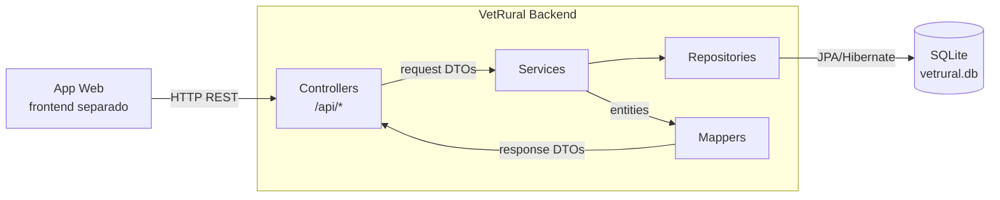
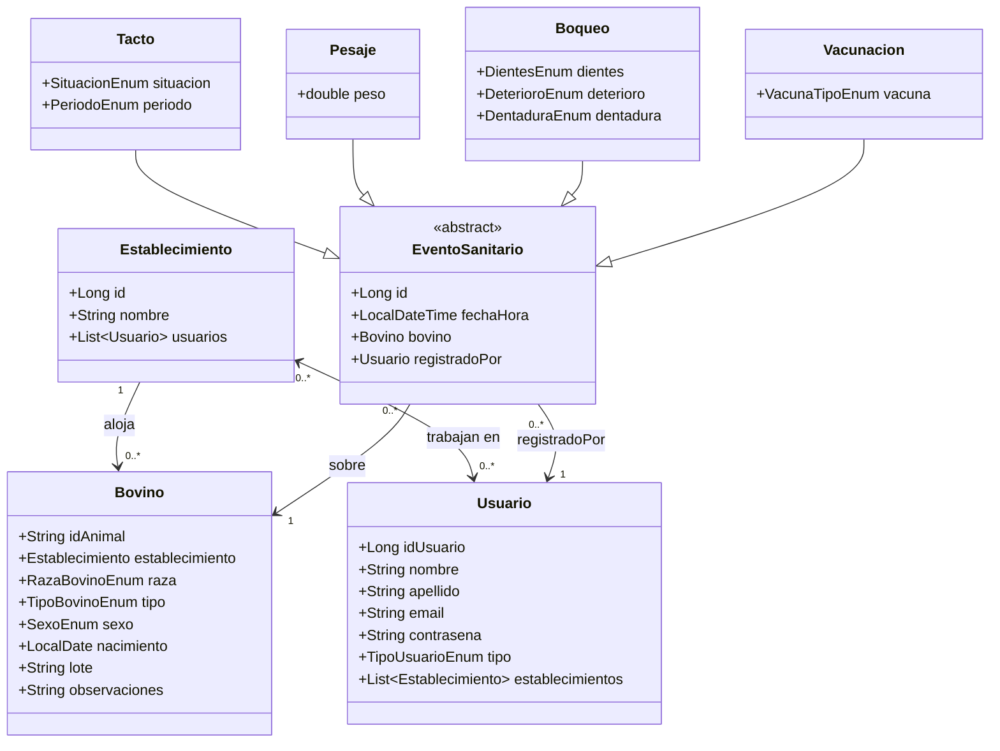

# Spec Técnica — VetRural

> **Audiencia:** Desarrolladores que tienen que tocar este código.
> **Actualizada:** 2026-05-13 — refactor de modelo de dominio + review por Opus 4.7
> **Leyenda:** `[ACTUAL]` estado actual del código · `[OBJETIVO]` estado a implementar · `[CONFIRMED]` confirmado por el usuario · `[ASSUMPTION]` asunción a validar

---

## 1. Resumen técnico

VetRural es un monolito Spring Boot que expone una API REST. Corre en JVM (Java 17), persiste en SQLite mediante Hibernate/JPA, y está pensado para correr como proceso único en un servidor local o en la nube. [CONFIRMED] Una app web separada consume la API como único cliente.

## 2. Stack y versiones

| Componente | Tecnología | Versión | Notas |
|------------|------------|---------|-------|
| Lenguaje | Java | 17 | |
| Framework principal | Spring Boot | 4.0.6 | Incluye Spring MVC |
| Persistencia | Spring Data JPA + Hibernate | (gestionada por Boot) | Dialect: SQLiteDialect (hibernate-community-dialects) |
| Base de datos | SQLite | (runtime) | Archivo local `vetrural.db` |
| Build | Maven | (wrapper incluido) | mvnw / mvnw.cmd |
| Boilerplate | Lombok | (gestionada por Boot) | `@Getter`, `@Setter`, `@NoArgsConstructor`, `@AllArgsConstructor` |
| Testing | Spring Boot Test (jdbc, thymeleaf, webmvc) | (gestionada por Boot) | Sin tests implementados |

> Thymeleaf sigue en deps pero sin uso. Candidato a eliminar.

## 3. Arquitectura

### 3.1 Estilo arquitectónico

Monolito en capas clásico (Spring MVC): Controller → Service → Repository → Entity. No hay DDD, hexagonal ni event-driven. La lógica de negocio vive en los Services; los Controllers son delgados y solo traducen HTTP ↔ llamadas de servicio. Los Controllers nunca devuelven entidades directamente — usan DTOs de respuesta mapeados por la capa `mapper/`.

### 3.2 Estructura de carpetas objetivo

```
src/main/java/vetrural/mvc/
├── MvcApplication.java
├── controller/
│   ├── BovinoController.java
│   ├── EstablecimientoController.java
│   ├── MangaController.java
│   └── UsuarioController.java
├── service/
│   ├── BovinoService.java
│   ├── EstablecimientoService.java
│   ├── MangaService.java
│   ├── TactoService.java
│   ├── PesajeService.java
│   ├── BoqueoService.java
│   ├── VacunacionService.java
│   └── UsuarioService.java
├── repository/
│   ├── BovinoRepository.java
│   ├── EstablecimientoRepository.java
│   ├── EventoSanitarioRepository.java  # Queries polimórficas sobre la base
│   ├── UsuarioRepository.java
│   ├── TactoRepository.java
│   ├── PesajeRepository.java
│   ├── BoqueoRepository.java
│   └── VacunacionRepository.java
├── entity/
│   ├── Bovino.java
│   ├── Establecimiento.java
│   ├── Usuario.java
│   ├── EventoSanitario.java       # Abstracta, herencia JOINED
│   ├── Tacto.java
│   ├── Pesaje.java
│   ├── Boqueo.java
│   └── Vacunacion.java
├── dto/
│   ├── request/
│   │   ├── CrearBovinoRequest.java
│   │   ├── CrearBovinoRapidoRequest.java
│   │   ├── CrearEstablecimientoRequest.java
│   │   ├── CrearUsuarioRequest.java
│   │   ├── RegistrarTactoRequest.java
│   │   ├── RegistrarPesajeRequest.java
│   │   ├── RegistrarBoqueoRequest.java
│   │   └── RegistrarVacunacionRequest.java
│   └── response/
│       ├── BovinoResponse.java
│       ├── EstablecimientoResponse.java
│       ├── TactoResponse.java
│       ├── PesajeResponse.java
│       ├── BoqueoResponse.java
│       └── VacunacionResponse.java
├── mapper/
│   ├── BovinoMapper.java
│   ├── EstablecimientoMapper.java
│   ├── TactoMapper.java
│   ├── PesajeMapper.java
│   ├── BoqueoMapper.java
│   └── VacunacionMapper.java
└── enumerations/
    ├── TipoBovinoEnum.java
    ├── RazaBovinoEnum.java
    ├── SexoEnum.java
    ├── SituacionEnum.java
    ├── PeriodoEnum.java
    ├── DientesEnum.java
    ├── DeterioroEnum.java
    ├── DentaduraEnum.java
    ├── TipoUsuarioEnum.java
    └── VacunaTipoEnum.java
```

### 3.3 Diagrama de componentes



## 4. Modelo de datos

### 4.1 Diagrama de entidades [OBJETIVO]



### 4.2 Entidades [OBJETIVO]

#### `Establecimiento`

- **Propósito:** lugar físico donde viven los animales y donde se realizan las jornadas de trabajo.
- **Atributos:** `id` (Long, PK, autogenerado) · `nombre` (String)
- **Relaciones:** `usuarios` (@ManyToMany con Usuario, dueño de la relación — tiene la tabla de join `establecimiento_usuarios`)
- **Nota:** los bovinos del establecimiento se consultan vía `BovinoRepository.findByEstablecimiento()`, no con una colección en la entidad. Evita carga lazy accidental de miles de bovinos al serializar un establecimiento.

#### `Bovino`

- **Propósito:** animal bovino identificado por caravana electrónica.
- **Atributos:** `idAnimal` (String, PK, max 15 chars, `nullable = false`) · `raza` (RazaBovinoEnum, nullable) · `tipo` (TipoBovinoEnum, nullable) · `sexo` (SexoEnum) · `nacimiento` (LocalDate, nullable) · `lote` (String, nullable) · `observaciones` (String, nullable)
- **Relaciones:** `establecimiento` (@ManyToOne, `nullable = false`)
- **Nota:** `raza`, `tipo` y `nacimiento` son nullable para soportar el registro rápido en manga. `establecimiento` nunca es nulo — todo bovino pertenece a un establecimiento desde el momento de su creación.

#### `Usuario`

- **Propósito:** persona que opera el sistema.
- **Atributos:** `idUsuario` (Long, PK, autogenerado) · `nombre` · `apellido` · `email` · `contrasena` · `tipo` (TipoUsuarioEnum)
- **Relaciones:** `establecimientos` (@ManyToMany con Establecimiento, lado inverso — `mappedBy = "usuarios"`)
- **Restricción de negocio:** [OBJETIVO] solo usuarios de tipo `Veterinario` o `Anotador` pueden registrar `EventoSanitario`. Validado en `MangaService`.

#### `EventoSanitario` (abstracta)

- **Propósito:** clase base para todos los procedimientos sanitarios registrados sobre un bovino.
- **Atributos:** `id` (Long, PK, autogenerado) · `fechaHora` (LocalDateTime)
- **Relaciones:** `bovino` (@ManyToOne Bovino, `nullable = false`) · `registradoPor` (@ManyToOne Usuario, `nullable = false`)
- **Herencia:** `InheritanceType.JOINED` — tabla `EventoSanitario` con los campos base + tabla hija por subtipo con sus campos propios.
- **IDs de subtipos:** las entidades hijas (`Tacto`, `Pesaje`, `Boqueo`, `Vacunacion`) **no declaran su propio `@Id`** — heredan el `id` de `EventoSanitario`. Los campos `idTacto`, `idPesaje`, `idBoqueo`, `idVacunacion` del código actual deben eliminarse.
- **Query patrón por tipo:** `findTopByBovinoOrderByFechaHoraDesc(Bovino bovino)` en el repository del subtipo.
- **Query polimórfica:** `EventoSanitarioRepository.findByBovinoOrderByFechaHoraDesc(Bovino bovino)` devuelve todos los eventos del bovino sin importar el tipo.

#### `Tacto`

- **Propósito:** resultado de un tacto rectal — determina el estado reproductivo de la vaca.
- **Atributos propios:** `situacion` (SituacionEnum) · `periodo` (PeriodoEnum, nullable — solo aplica si `situacion = Preñada`)

#### `Pesaje`

- **Propósito:** registro del peso del animal en kg.
- **Atributos propios:** `peso` (double) — se usa `double` y no `float` para evitar pérdida de precisión en datos biológicos.

#### `Boqueo`

- **Propósito:** examen de dentición para estimar la edad del animal.
- **Atributos propios:** `dientes` (DientesEnum) · `deterioro` (DeterioroEnum) · `dentadura` (DentaduraEnum)

#### `Vacunacion`

- **Propósito:** registro de una vacuna aplicada al animal.
- **Atributos propios:** `vacuna` (VacunaTipoEnum)
- **Nota:** una fila por vacuna aplicada. La fecha de aplicación es `EventoSanitario.fechaHora`. Si se aplican varias vacunas en la misma visita, se crean múltiples registros — uno por vacuna.

### 4.3 Enumeraciones

| Enum | Valores |
|------|---------|
| `TipoBovinoEnum` | Ternero · Novillito · Novillo · Vaquillona · Vaca · Torito · Toro |
| `RazaBovinoEnum` | Angus · Hereford · Brangus · Braford · Holstein · Jersey · Charolais · Limousin · Simmental · Brahman · Nelore · Gyr |
| `SexoEnum` | Macho · Hembra |
| `SituacionEnum` | Preñada · Perdonada · Frigorifico · Apta_Servicio |
| `PeriodoEnum` | Menos_3_Meses · Entre_3_y_6_Meses · Mas_6_Meses |
| `DientesEnum` | Dos · Cuatro · Seis · Ocho |
| `DeterioroEnum` | Nulo · Leve · Moderado · Severo |
| `DentaduraEnum` | De_Leche · Mixta · Permanente |
| `TipoUsuarioEnum` [OBJETIVO] | Veterinario · **Anotador** · Productor_Agropecuario |
| `VacunaTipoEnum` [OBJETIVO] | Aftosa · Brucelosis · Carbunco · Clostridial · IBR_BVD |

### 4.4 Migración de datos

Este refactor cambia el schema drásticamente: elimina tablas (`Animal`, `Sesion`), agrega tablas (`Establecimiento`, `EventoSanitario`), cambia FKs (de `String idBovino` a `bovino_id` FK real) y cambia columnas (`Vacunacion` de 5 fechas a 1 enum). **`ddl-auto=update` no maneja renames ni transformaciones de datos.**

**Decisión para MVP:** se asume base de datos en blanco. Borrar `vetrural.db` antes de levantar el backend con el nuevo código. No hay datos de producción que preservar en esta etapa.

## 5. Superficie de API

### 5.1 Endpoints HTTP [OBJETIVO]

**Establecimientos** (`/api/establecimientos`)

| Método | Ruta | Propósito |
|--------|------|-----------|
| `GET` | `/api/establecimientos` | Listar establecimientos |
| `GET` | `/api/establecimientos/{id}` | Obtener establecimiento por ID |
| `POST` | `/api/establecimientos` | Crear establecimiento |
| `GET` | `/api/establecimientos/{id}/bovinos` | Listar bovinos del establecimiento |
| `POST` | `/api/establecimientos/{id}/usuarios/{usuarioId}` | Asociar usuario a establecimiento |
| `DELETE` | `/api/establecimientos/{id}/usuarios/{usuarioId}` | Desasociar usuario de establecimiento |

**Bovinos** (`/api/bovinos`)

| Método | Ruta | Propósito |
|--------|------|-----------|
| `GET` | `/api/bovinos` | Listar todos los bovinos |
| `GET` | `/api/bovinos/{id}` | Obtener bovino por ID |
| `POST` | `/api/bovinos` | Crear bovino con datos completos |
| `POST` | `/api/bovinos/rapido` | Crear bovino rápido (ID + sexo + establecimiento) |
| `PUT` | `/api/bovinos/{id}/observaciones` | Actualizar observaciones |
| `PUT` | `/api/bovinos/{id}/lote` | Asignar bovino a lote |
| `GET` | `/api/bovinos/{id}/existe` | Verificar existencia |
| `GET` | `/api/bovinos/lotes` | Listar todos los lotes |
| `GET` | `/api/bovinos/lotes/{lote}` | Listar bovinos de un lote |
| `POST` | `/api/bovinos/lotes` | Crear lote con lista de bovinos |
| `DELETE` | `/api/bovinos/lotes` | Eliminar lote (query param `nombre`) |

**Manga** (`/api/manga`)

| Método | Ruta | Propósito |
|--------|------|-----------|
| `POST` | `/api/manga/tacto` | Registrar tacto rectal |
| `POST` | `/api/manga/pesaje` | Registrar pesaje |
| `POST` | `/api/manga/boqueo` | Registrar boqueo |
| `POST` | `/api/manga/vacunacion` | Registrar vacunación (una vacuna por request) |
| `GET` | `/api/manga/{bovinoId}/eventos` | Cronología completa de eventos del bovino |
| `GET` | `/api/manga/{bovinoId}/ultimo-tacto` | Último tacto del bovino |
| `GET` | `/api/manga/{bovinoId}/ultimo-pesaje` | Último pesaje del bovino |
| `GET` | `/api/manga/{bovinoId}/ultimo-boqueo` | Último boqueo del bovino |
| `GET` | `/api/manga/{bovinoId}/vacunaciones` | Historial de vacunaciones del bovino |

**Usuarios** (`/api/usuarios`)

| Método | Ruta | Propósito |
|--------|------|-----------|
| `GET` | `/api/usuarios` | Listar usuarios |
| `GET` | `/api/usuarios/{id}` | Obtener usuario por ID |
| `POST` | `/api/usuarios` | Crear usuario |
| `DELETE` | `/api/usuarios/{id}` | Eliminar usuario |
| `GET` | `/api/usuarios/veterinarios` | Listar veterinarios |
| `GET` | `/api/usuarios/{id}/establecimientos` | Listar establecimientos del usuario |

### 5.2 Autenticación / Autorización

[ACTUAL] No existe. No hay Spring Security configurado. Todos los endpoints son públicos.

[OBJETIVO] `MangaService` validará que el `registradoPorId` corresponde a un usuario de tipo `Veterinario` o `Anotador` antes de persistir cualquier `EventoSanitario`. Esta validación **no existe aún en el código** — está pendiente de implementar.

### 5.3 DTOs

#### Request DTOs

| DTO | Campos |
|-----|--------|
| `CrearEstablecimientoRequest` | `nombre` |
| `CrearBovinoRequest` | `id` · `establecimientoId` · `raza` · `tipo` · `sexo` · `nacimiento` · `observaciones` |
| `CrearBovinoRapidoRequest` | `id` · `establecimientoId` · `sexo` |
| `CrearUsuarioRequest` | `nombre` · `apellido` · `email` · `contrasena` · `tipo` |
| `RegistrarTactoRequest` | `bovinoId` · `registradoPorId` · `situacion` · `periodo` (nullable) |
| `RegistrarPesajeRequest` | `bovinoId` · `registradoPorId` · `peso` |
| `RegistrarBoqueoRequest` | `bovinoId` · `registradoPorId` · `dientes` · `deterioro` · `dentadura` |
| `RegistrarVacunacionRequest` | `bovinoId` · `registradoPorId` · `vacuna` (VacunaTipoEnum) |

#### Response DTOs

Los controllers nunca serializan entidades directamente — evita ciclos de serialización y exposición de datos sensibles (ej: `contrasena`).

| DTO | Campos |
|-----|--------|
| `EstablecimientoResponse` | `id` · `nombre` |
| `BovinoResponse` | `idAnimal` · `establecimientoId` · `raza` · `tipo` · `sexo` · `nacimiento` · `lote` · `observaciones` |
| `TactoResponse` | `id` · `fechaHora` · `bovinoId` · `registradoPorId` · `situacion` · `periodo` |
| `PesajeResponse` | `id` · `fechaHora` · `bovinoId` · `registradoPorId` · `peso` |
| `BoqueoResponse` | `id` · `fechaHora` · `bovinoId` · `registradoPorId` · `dientes` · `deterioro` · `dentadura` |
| `VacunacionResponse` | `id` · `fechaHora` · `bovinoId` · `registradoPorId` · `vacuna` |

### 5.4 Mappers

Clases estáticas manuales (sin MapStruct ni librerías extra). Un mapper por entidad — evita una clase monolítica con responsabilidades mezcladas. Cada mapper expone `toResponse(Entity e)`.

| Mapper | Responsabilidad |
|--------|----------------|
| `BovinoMapper` | `Bovino → BovinoResponse` |
| `EstablecimientoMapper` | `Establecimiento → EstablecimientoResponse` |
| `TactoMapper` | `Tacto → TactoResponse` |
| `PesajeMapper` | `Pesaje → PesajeResponse` |
| `BoqueoMapper` | `Boqueo → BoqueoResponse` |
| `VacunacionMapper` | `Vacunacion → VacunacionResponse` |

## 6. Dependencias externas

### 6.1 Servicios externos

Ninguno. El sistema es completamente autónomo.

### 6.2 Librerías críticas

- **Spring Boot 4.0.6** — framework principal: IoC, MVC, Data JPA.
- **SQLite JDBC (org.xerial)** — driver JDBC para SQLite.
- **hibernate-community-dialects** — dialecto de Hibernate para SQLite.
- **Lombok** — generación de boilerplate en tiempo de compilación.

## 7. Configuración

Archivo: `src/main/resources/application.properties`

```properties
spring.application.name=mvc
spring.datasource.url=jdbc:sqlite:vetrural.db
spring.datasource.driver-class-name=org.sqlite.JDBC
spring.jpa.database-platform=org.hibernate.community.dialect.SQLiteDialect
spring.jpa.hibernate.ddl-auto=update
spring.jpa.show-sql=true
```

## 8. Decisiones técnicas y trade-offs

### TD-01: SQLite como base de datos

- **Decisión:** SQLite — base de datos embebida en un archivo local (`vetrural.db`).
- **Trade-off:** cero infraestructura, portabilidad total. Contra: sin concurrencia real, sin replicación, sin acceso remoto simultáneo desde múltiples dispositivos.

### TD-02: Registro rápido de bovino

- **Decisión:** endpoint `POST /api/bovinos/rapido` que crea un bovino con solo ID + sexo + establecimiento, dejando raza/tipo/nacimiento nulos.
- **Trade-off:** fluidez en manga vs. datos incompletos. El frontend debe permitir completar los datos después.

### TD-03: `EventoSanitario` con herencia JOINED

- **Decisión:** clase abstracta `EventoSanitario` como base de `Tacto`, `Pesaje`, `Boqueo` y `Vacunacion`, con `InheritanceType.JOINED`.
- **Trade-off:** elimina duplicación de `bovino`/`fechaHora`/`registradoPor` en las cuatro entidades, habilita `EventoSanitarioRepository` para queries polimórficas (cronología completa del animal). Contra: un JOIN extra por cada consulta de subtipo. Aceptable dado el volumen esperado.
- **Alternativa descartada:** `SINGLE_TABLE` generaría demasiadas columnas nullable dado que los subtipos tienen campos muy distintos.

### TD-04: `MangaService` como orquestador

- **Decisión:** `MangaService` valida que el bovino existe y que el usuario tiene permisos (`Veterinario` o `Anotador`), luego delega a los services específicos.
- **Trade-off:** centraliza las dos validaciones transversales de manga en un único lugar. La indirección es justificada mientras esas validaciones existan.

### TD-05: Lotes como campo String en Bovino

- **Decisión:** el lote se guarda como `String` en `Bovino`, no como entidad con FK.
- **Trade-off:** simplicidad de implementación. Contra: sin integridad referencial; inconsistencias posibles por diferencias en capitalización o espacios.

### TD-06: Una fila por vacuna en `Vacunacion`

- **Decisión:** cada aplicación de vacuna es un `EventoSanitario` separado con un campo `VacunaTipoEnum`.
- **Trade-off:** modelo normalizado, queries limpias ("último aftosa del animal X"), fácil de extender con nuevas vacunas (agregar valor al enum). Contra: si se aplican 5 vacunas juntas, el frontend envía 5 requests. Si eso resulta problemático en campo (conectividad rural), se puede agregar un endpoint `POST /api/manga/vacunaciones` que acepte una lista — pendiente de necesidad real.
- **Alternativa no tomada:** enum + campo `observacion: String` para vacunas fuera del catálogo. Descartada por complejidad innecesaria en MVP.

### TD-07: Sin entidad `Sesion`

- **Decisión:** se eliminó `Sesion` como entidad de backend. Cada `EventoSanitario` tiene su propio `fechaHora` y `registradoPor`.
- **Trade-off:** modelo más simple y centrado en el dominio. Contra: (1) no hay agrupación explícita de eventos por jornada — si se necesita "todos los eventos del día X en el establecimiento Y", se consulta por rango de fechas y bovinos del establecimiento; (2) se pierde la funcionalidad de estadísticas agregadas que tenía `SesionService.actualizarEstadisticas()` (`contBovinos`, `acumPeso`, `contPrenadas`, `contVacias`, `edadPromedio`). Esos KPIs pasan a ser responsabilidad del frontend, que puede calcularlos a partir de los eventos individuales que ya retorna el backend.

### TD-08: `Establecimiento` sin `@OneToMany List<Bovino>`

- **Decisión:** `Establecimiento` no tiene una colección `bovinos` en la entidad. Los bovinos de un establecimiento se obtienen vía `BovinoRepository.findByEstablecimiento(establecimiento)`.
- **Trade-off:** evita carga lazy accidental de miles de bovinos al serializar un `Establecimiento` (riesgo real si un controller serializa entidades directamente o si un dev agrega `@JsonManagedReference` sin pensar). El endpoint `GET /api/establecimientos/{id}/bovinos` existe y hace la query explícita.

## 9. Deployment y runtime

- **Cómo se buildea:** `./mvnw clean package` → JAR ejecutable en `target/`.
- **Cómo corre:** `java -jar target/mvc-0.0.1-SNAPSHOT.jar` (Spring Boot embedded Tomcat).
- **Dónde corre:** [ASSUMPTION] local o servidor simple. Sin Dockerfile ni CI/CD.

## 10. Observabilidad

- **Logging:** Logback estándar de Spring Boot. `show-sql=true` imprime queries en consola.
- **Métricas / Tracing / Health:** no configurado.

## 11. Testing

- **Frameworks disponibles:** Spring Boot Test (jdbc-test, thymeleaf-test, webmvc-test).
- **Estado actual:** solo existe `MvcApplicationTests.java` con el test vacío del Initializr.
- **Cómo correr:** `./mvnw test`

## 12. Gaps técnicos

- **Sin autenticación/autorización:** todos los endpoints son públicos. La validación de tipo de usuario en `MangaService` es [OBJETIVO], no está implementada aún.
- **Sin validaciones de entrada:** ningún DTO usa `@Valid`. Campos faltantes o malformados pueden generar excepciones no controladas.
- **Sin manejo global de errores:** no hay `@ControllerAdvice`. Las `IllegalArgumentException` de los services retornan HTTP 500 en lugar de 400/404.
- **Sin edición ni eliminación de eventos sanitarios:** no hay endpoints `PUT`/`DELETE` sobre `Tacto`, `Pesaje`, `Boqueo` ni `Vacunacion`. Un error de tipeo en un peso no se puede corregir. Gap a resolver post-MVP.
- **Sin idempotencia en registro de eventos:** un retry del frontend en manga (conectividad intermitente) crea un evento duplicado. No hay mecanismo de deduplicación. Gap a resolver post-MVP.
- **`ddl-auto=update`:** no apto para refactors de schema drásticos ni para producción. Ver Sección 4.4.
- **`show-sql=true`:** ruidoso en producción.
- **Contraseña en texto plano:** el campo `contrasena` en `Usuario` no está hasheado. Crítico para usuarios reales.
- **Sin tests:** cobertura prácticamente nula.
- **Bug activo en `BovinoController`:** [ACTUAL] dos métodos `@PostMapping` sin path diferenciador — Spring MVC falla al arrancar. Requiere separar en `@PostMapping("/rapido")`.

## 13. Asunciones vigentes

- [CONFIRMED] El proyecto es un MVP/prototipo.
- [CONFIRMED] La app web existe en un repo separado.
- [ASSUMPTION] Para producción se parametrizará la ruta de `vetrural.db` via variable de entorno.
- [ASSUMPTION] Lotes scoped al establecimiento — bovinos de diferentes establecimientos no comparten espacio de nombres de lotes (no hay restricción técnica que lo garantice).
- [ASSUMPTION] Las estadísticas agregadas que antes calculaba `Sesion` (contBovinos, acumPeso, etc.) son ahora responsabilidad del frontend, calculadas a partir de los eventos individuales retornados por el backend.
- [ASSUMPTION] Los Productores no registran eventos sanitarios — solo Veterinarios y Anotadores. Esta restricción de negocio no está documentada en el spec funcional y debería confirmarse.

---

## 14. TODO — Pendiente de implementar

### Orden de implementación recomendado

Para no romper el build innecesariamente, seguir este orden:

1. Enumeraciones nuevas
2. Entidades nuevas / refactorizadas (de abajo hacia arriba: `EventoSanitario` antes que sus hijos)
3. Repositories
4. Services
5. DTOs y Mappers
6. Controllers

---

### Enumeraciones

- [ ] Crear `VacunaTipoEnum.java`: `Aftosa`, `Brucelosis`, `Carbunco`, `Clostridial`, `IBR_BVD`
- [ ] Modificar `TipoUsuarioEnum.java`: renombrar `Otro` → `Anotador`

### Entidades

- [ ] Eliminar `Animal.java`
- [ ] Modificar `Bovino.java`: quitar `extends Animal`, inlinear todos los campos de `Animal` (`idAnimal`, `nacimiento`, `sexo`, `lote`, `observaciones`), agregar `@ManyToOne @JoinColumn(nullable=false) Establecimiento establecimiento`
- [ ] Crear `Establecimiento.java`: `id` (Long, PK, autogenerado) · `nombre` · `@ManyToMany @JoinTable(...) List<Usuario> usuarios`
- [ ] Modificar `Usuario.java`: reemplazar `@ElementCollection List<String> establecimientos` por `@ManyToMany(mappedBy="usuarios") List<Establecimiento> establecimientos`
- [ ] Eliminar `Sesion.java`
- [ ] Crear `EventoSanitario.java`: abstracta, `@Inheritance(JOINED)`, `@Id id` (Long) · `fechaHora` (LocalDateTime) · `@ManyToOne(nullable=false) Bovino bovino` · `@ManyToOne(nullable=false) Usuario registradoPor`
- [ ] Modificar `Tacto.java`: `extends EventoSanitario`, eliminar `idTacto` (Long) y `idBovino` (String)
- [ ] Modificar `Pesaje.java`: `extends EventoSanitario`, eliminar `idPesaje` (Long) y `idBovino` (String), cambiar `peso` de `float` a `double`
- [ ] Modificar `Boqueo.java`: `extends EventoSanitario`, eliminar `idBoqueo` (Long) y `idBovino` (String)
- [ ] Modificar `Vacunacion.java`: `extends EventoSanitario`, eliminar `idVacunacion` (Long), `idBovino` (String) y los 5 campos de fecha (`aftosa`, `brucelosis`, `carbunco`, `clostridial`, `ibr_bvd`), agregar `VacunaTipoEnum vacuna`

### Repositories

- [ ] Crear `EstablecimientoRepository.java`
- [ ] Crear `EventoSanitarioRepository.java`: `List<EventoSanitario> findByBovinoOrderByFechaHoraDesc(Bovino bovino)` — permite la cronología completa polimórfica
- [ ] Eliminar `SesionRepository.java`
- [ ] Agregar en `TactoRepository`: `Optional<Tacto> findTopByBovinoOrderByFechaHoraDesc(Bovino bovino)`
- [ ] Agregar en `PesajeRepository`: `Optional<Pesaje> findTopByBovinoOrderByFechaHoraDesc(Bovino bovino)`
- [ ] Agregar en `BoqueoRepository`: `Optional<Boqueo> findTopByBovinoOrderByFechaHoraDesc(Bovino bovino)`
- [ ] Agregar en `VacunacionRepository`: `List<Vacunacion> findByBovinoOrderByFechaHoraDesc(Bovino bovino)`
- [ ] Agregar en `BovinoRepository`: `List<Bovino> findByEstablecimiento(Establecimiento establecimiento)`

### Services

- [ ] Crear `EstablecimientoService.java`: CRUD + asociar/desasociar usuarios
- [ ] Eliminar `SesionService.java`
- [ ] Actualizar `BovinoService.java`: recibir `establecimientoId` en creación (completa y rápida); resolver el `Establecimiento` desde el repositorio antes de crear el `Bovino`
- [ ] Actualizar `MangaService.java`: recibir `registradoPorId`, [OBJETIVO] validar que el usuario es `Veterinario` o `Anotador`, pasar `Bovino` y `Usuario` como objetos a los sub-services
- [ ] Actualizar `TactoService`, `PesajeService`, `BoqueoService`, `VacunacionService`: recibir `Bovino bovino` y `Usuario registradoPor` como objetos JPA (no Strings), construir y guardar el `EventoSanitario` correspondiente

### Controllers

- [ ] Crear `EstablecimientoController.java`: incluir endpoints de asociación usuario↔establecimiento
- [ ] Eliminar `SesionController.java`
- [ ] Corregir bug en `BovinoController.java`: mover `crearRapido` a `@PostMapping("/rapido")`
- [ ] Agregar en `MangaController.java`: endpoints GET para último-tacto, último-pesaje, último-boqueo, historial-vacunaciones y cronología completa (`/eventos`)
- [ ] Agregar en `UsuarioController.java`: endpoint `GET /api/usuarios/{id}/establecimientos`
- [ ] Todos los controllers deben retornar response DTOs mapeados — nunca entidades directamente
- [ ] Actualizar `UsuarioController.crear`: actualmente recibe la entidad `Usuario` cruda; cambiar a `CrearUsuarioRequest`

### DTOs

- [ ] Reorganizar `dto/` en subcarpetas `request/` y `response/`
- [ ] Crear `CrearEstablecimientoRequest.java`
- [ ] Crear `CrearBovinoRapidoRequest.java`: `id`, `establecimientoId`, `sexo`
- [ ] Crear `CrearUsuarioRequest.java`: `nombre`, `apellido`, `email`, `contrasena`, `tipo`
- [ ] Actualizar `CrearBovinoRequest.java`: agregar `establecimientoId`
- [ ] Actualizar `RegistrarTactoRequest.java`: agregar `registradoPorId`
- [ ] Actualizar `RegistrarPesajeRequest.java`: agregar `registradoPorId`
- [ ] Actualizar `RegistrarBoqueoRequest.java`: agregar `registradoPorId`
- [ ] Reemplazar `RegistrarVacunacionRequest.java`: eliminar 5 fechas, agregar `vacuna` (VacunaTipoEnum) y `registradoPorId`
- [ ] Eliminar `CrearSesionRequest.java`
- [ ] Crear response DTOs: `EstablecimientoResponse`, `BovinoResponse`, `TactoResponse`, `PesajeResponse`, `BoqueoResponse`, `VacunacionResponse`

### Mappers

- [ ] Crear `BovinoMapper.java`: `toResponse(Bovino b) → BovinoResponse`
- [ ] Crear `EstablecimientoMapper.java`: `toResponse(Establecimiento e) → EstablecimientoResponse`
- [ ] Crear `TactoMapper.java`: `toResponse(Tacto t) → TactoResponse`
- [ ] Crear `PesajeMapper.java`: `toResponse(Pesaje p) → PesajeResponse`
- [ ] Crear `BoqueoMapper.java`: `toResponse(Boqueo b) → BoqueoResponse`
- [ ] Crear `VacunacionMapper.java`: `toResponse(Vacunacion v) → VacunacionResponse`

### Deuda técnica a incorporar en este sprint (recomendado)

- [ ] Agregar `@ControllerAdvice` global: mapear `IllegalArgumentException` → 400, `EntityNotFoundException` → 404
- [ ] Agregar `@Valid` en todos los controllers que reciben request bodies
